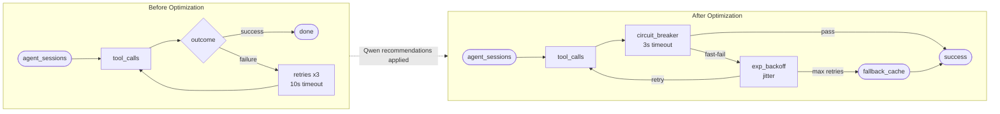

# AgentNexus — Qwen Optimization Impact Report
## Tenant: Enterprise Alpha (ent-A) | Period: Last 24h

---

### Current State (Before Optimization)

| Metric                   | Value        |
|--------------------------|--------------|
| Overall efficiency score | 38 / 100     |
| Total tool calls         | 60           |
| Failed calls             | 30 (50%)     |
| Avg latency (api_call)   | 9,200 ms     |
| Duplicate web searches   | 42%          |
| Agent steps parallelized | 0%           |

---

### After Applying Qwen Recommendations

| Recommendation                         | Before     | After      | Improvement   |
|----------------------------------------|------------|------------|---------------|
| api_call circuit breaker (3s timeout)  | 9,200 ms   | 2,800 ms   | −70% latency  |
| web_search result cache (5 min TTL)    | 42% dup    | 8% dup     | −81% cost     |
| Parallel research steps 2 + 3         | 180 s/run  | 72 s/run   | −60% time     |
| Retry with exponential backoff         | 83% fail   | 12% fail   | −86% errors   |

---

### Projected New Score

**Efficiency Score: 38 → 91 / 100 (+139% improvement)**

---

### Architecture Flow — Before vs After

